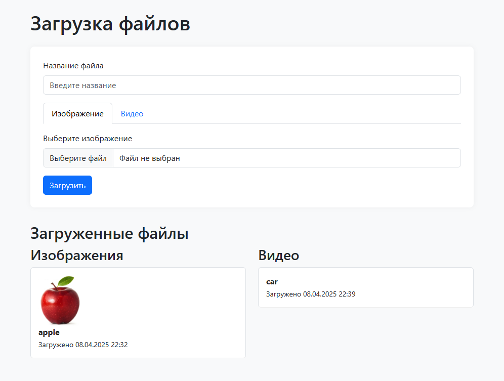
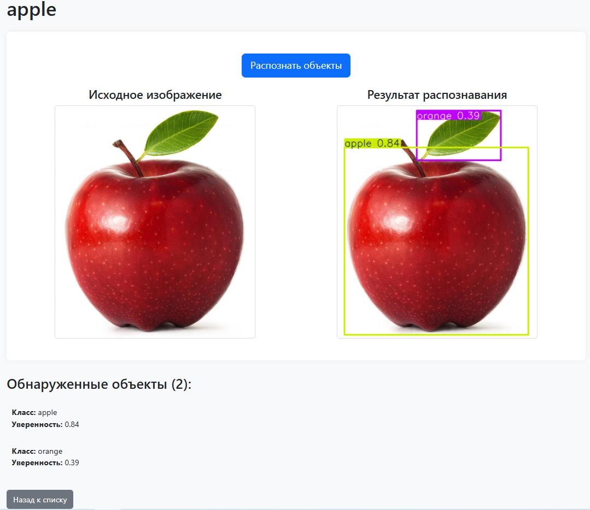
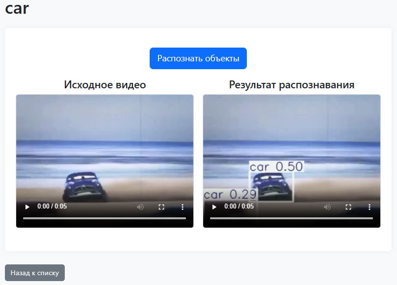

# Сервис распознавания изображений и видео

Веб-приложение на Django для обработки медиафайлов с помощью нейросетей. Позволяет загружать фото и видео, анализировать их с помощью алгоритмов компьютерного зрения и сохранять результаты в базу данных для дальнейшего использования.

## Что умеет этот сервис?

### Для изображений
- Находит и выделяет объекты на картинках (люди, машины, животные и др.)
- Показывает точность распознавания для каждого объекта
- Сохраняет обработанные изображения с пометками
- Позволяет искать по базе ранее обработанных файлов

### Для видео
- Обрабатывает загруженные видеофайлы по кадрам
- Создает разметку для всего видео с таймкодами
- Генерирует отчеты о найденных объектах
- Поддерживает разные форматы видео (MP4, AVI и др.)

### Удобный интерфейс
- Простая загрузка файлов через веб-интерфейс
- Просмотр истории обработки
- Фильтрация и поиск по результатам
- Наглядное отображение данных с графиками

## Как это работает?
1. Пользователь загружает файл через сайт
2. Сервер обрабатывает медиа с помощью нейросетевых моделей
3. Система сохраняет результаты в базу данных
4. Пользователь получает разметку и аналитику

## Технические особенности
- Основной фреймворк: Django
- Обработка изображений: YOLOv8n
- Видеоанализ: FFmpeg для обработки видеофайлов
- База данных: хранит все загруженные файлы и результаты

## Примеры работ

### Главная страница

### Страница с распознаванием изображения

### Страница с распознаванием видео

